# How to NOT build a two stage model rocket

So… I don’t usually write blogs  mostly because I thought I wasn’t the “blogging type” (whatever that means). Actually, this is my first one. But after what happened during our first two-stage rocket attempt, I figured — yeah, it’s probably worth writing about. If nothing else, maybe someone else can laugh, learn, and avoid making the same mistakes we did.

It started off like any good launch day. The rocket was prepped, the team was hyped, someone shouted “start!” (it was me) even though the rocket was somewhere in the shot — if you squint and use your imagination.

We began the countdown with full confidence.

3… 2… 1… LAUNCH!

What followed was… not flight. The rocket lifted maybe a few meters off the pad, sighed like it had second thoughts, and flopped over like a fainting goat. The motor technically fired — just not enough to impress anyone, including the rocket itself.

We stood there in silence. Someone clapped. We all laughed.

This blog is a mix of that story — and all the other things that went slightly or wildly wrong — wrapped up with actual lessons about what not to do when building a two-stage model rocket. If you're a fellow enthusiast, a curious beginner, or just here for the explosions, welcome aboard.

## The Dream

Before we talk about Venessa’s (yes, it was a concious decision to name the rocket Venessa) design, problems, and the oh-my-god-what-just-happened moments, let’s take a step back.

**Why even build a two-stage rocket in the first place?**

It’s simple—because it’s cool. But also because it’s hard. And that’s exactly what makes it worth doing. Two-stage rockets introduce a whole new layer of complexity compared to single-stage flights. You’re not just launching a rocket anymore—you’re launching a rocket that splits into two mid-air, and both halves need to do what they’re supposed to.

This complexity is exactly why we decided to build Venessa, our first two-stage rocket.

We weren’t chasing records or altitude this time. The goal was simple:\
Design, build, and successfully execute a stage separation event—the part where the upper stage cleanly detaches and continues its journey after the first stage burns out.

That’s it.

This small but critical demonstration was meant to pave the way for _Asthsiddhi_, our larger and more capable two-stage rocket that’s currently in development. Venessa was a stepping stone— an experiment, and more importantly, a learning experience.

Our guiding principle from day one was:\
“Do it in the simplest way that still teaches you the hard stuff.”

This philosophy shaped everything—how we built our motors, chose our materials, designed our avionics, and even decided which parts were worth overengineering (and which ones we could just glue together and pray for the best).

What followed was months of design, iteration, fabrication, failed tests, and re-dos.

But it all started with a single goal:

Can we design a rocket that breaks apart mid-flight—intentionally—and not get absolutely roasted by gravity?

Let’s see how that went.

Vanessa wasn’t about going higher or faster. It was about going smarter.

From the very beginning, the design philosophy was simple:\
Focus on mastering stage separation, not perfection.

So instead of chasing every performance metric, we kept our sights on the core challenge—making a two-stage rocket separate mid-flight in a controlled and reliable way. Everything else—structure, propulsion, avionics—was built around that singular goal.

We knew there would be compromises. And we were okay with that. Not everything needed to be aerospace-grade. We didn’t need fiberglass or carbon fiber. What we needed was something that worked just well enough to get us to the learning moment.

At every step, we asked ourselves:

“What’s the easiest way we can build this and still learn the hard lesson?”

Sometimes that meant using a cardboard cut out part that could’ve been 3D printed. Sometimes it meant using a paper tube instead of an expensive composite body. Sometimes it meant letting a stage fall ballistically with no recovery system (RIP first stage, you did your job).

But that’s the beauty of a learning prototype—freedom to make mistakes on purpose.

Vanessa wasn't a rocket built for glory—it was a rocket built to teach us.

### Propulsion

When it came to propulsion, we decided to graduate from our unreliable PVC days and finally enter the metal age.

We designed solid rocket motors with a stainless steel casing, aluminum end cap, and a mild steel nozzle. Fancy, right? Turns out, PVC was never the move. It’s lightweight, yes, but also has the structural integrity of a soggy biscuit under pressure. Metal, while harder to work with, gave us something far more valuable—consistency and peace of mind (plus fewer heart attacks during static tests).

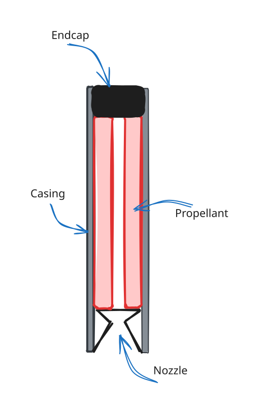

For the fuel, we used good ol’ KNDX—a mixture of Potassium Nitrate (oxidizer) and Dextrose (fuel). Why? Because we’ve been cooking this sugary goodness for over a year now. At this point, our mixers could probably run a bakery. Or so we thought (This isn’t foreshadowing I promise)

The process involves mixing the components in their stoichiometric ratio, then carefully melting, casting, and curing them into grains—those little cylindrical packets of thrust that determine your burn profile. Honestly, this whole thing deserves its own blog. Maybe one day.

<figure>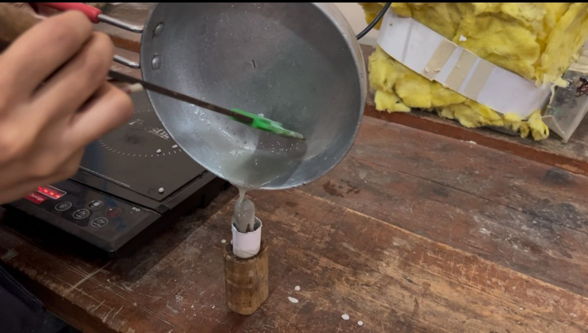<figcaption>
Casting a Fuel Grain
</figcaption></figure> <figure>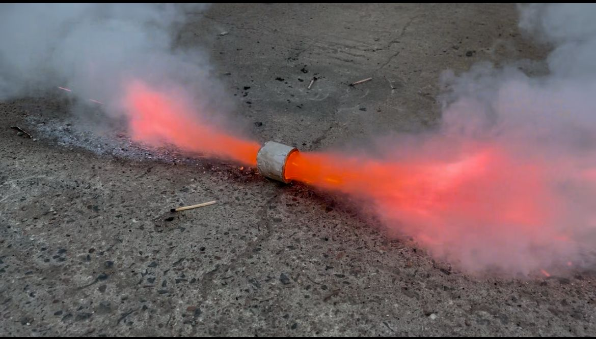<figcaption>
Test Fire of Grain
</figcaption></figure>

To simulate and design the motor, we used[ OpenMotor](https://github.com/riskable/OpenMotor), an open-source software where you throw in your grain geometry, number of grains and nozzle dimensions etc —and it spits out performance predictions. Two things we always fix first in our motor design:

* Thrust (how fast we want to go)
* Impulse (how far we want to go)

<figure>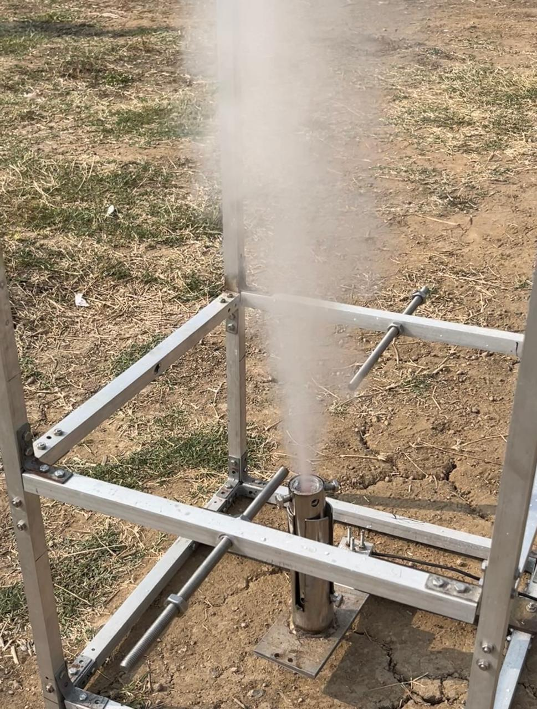<figcaption>
Static Fire Test
</figcaption></figure> <figure>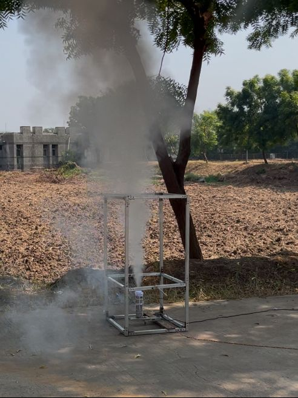<figcaption>
Another Static Fire Test 
</figcaption></figure>

Once we have those locked in, it’s a game of tweaking until the graph looks like something you’d proudly frame on your lab wall.

We ended up with two motors:

* G136
* G96

The naming isn’t random; check out[ this guide](https://en.wikipedia.org/wiki/Model_rocket_motor_classification) if you want to get nerdy about it.\
TL;DR: The number after the letter tells you average thrust (in Newtons). So yeah, G136 hits harder than G96.

Each stage had its own motor. G136 powered the first stage, and G96 took over once separation happened. No fancy ignition system—just the pure hope that our avionics systems and calculations were right.

So, propulsion was equal parts physics, math, and crossing fingers. And somehow, that combination didn’t blow up in our faces.

Not too badly, anyway.

### Structure

If propulsion is the fire, structure is the skeleton that holds it all together—and for us, that skeleton was made of… paper. Yep, you read that right.

#### Body

The main body tube of our rocket was handcrafted using strips of paper—specifically, old Engineering Drawing sheets left abandoned by students. Instead of buying off-the-shelf cardboard tubes, we repurposed these thick, high-quality sheets. Not only did it make the build more fun and hands-on, but it also saved us a bit of cost (though that wasn’t the primary reason).

**The construction method was pretty neat**

We built the body tube layer by layer by spirally winding strips of paper over a PVC pipe. Each layer used about 5–6 strips, and every new layer was wound in the opposite direction of the previous one. This alternating spiral created a crosshatched pattern that added impressive strength and rigidity. In total, we applied around 5–6 such layers, all bonded with our trusty Fevicol-and-water mix—like a well-crafted paper-mâché shell, but engineered for flight.

<figure>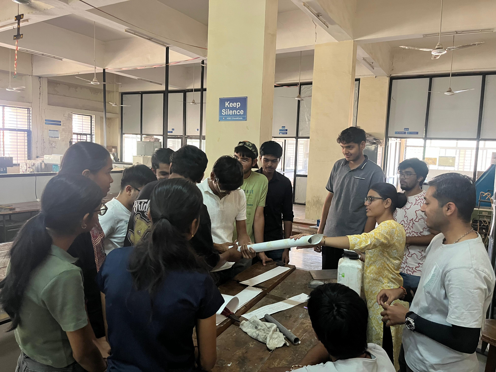<figcaption>
Our New Recurits learning how to make paper body
</figcaption></figure>

#### Nose Cone

Our nose cone followed a clean ogive profile and was 3D printed using PLA filament. \
While we’ve experimented with paper-crafted nose cones in the past, 3D printing offers consistency, precision, and speed. If you’ve got a printer—it’s a no-brainer.

<figure><figcaption>
3D Printed Nosecone
</figcaption></figure> <figure>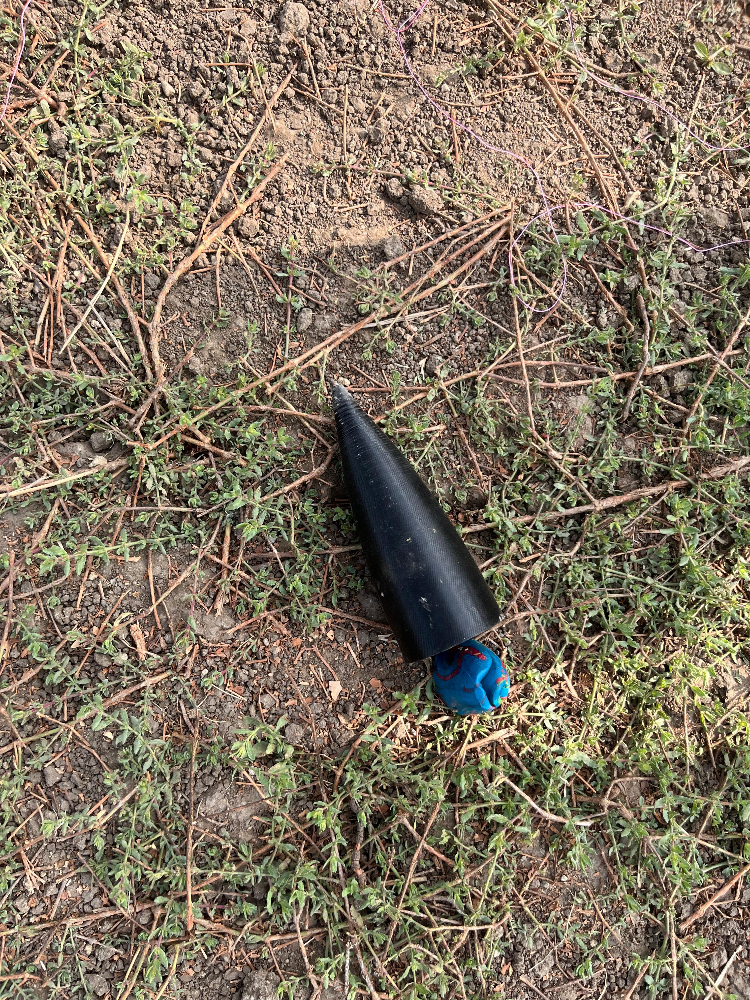<figcaption>
Ejecjected Nosecone after Flight
</figcaption></figure>

#### Fincan & Fins

The fincan and fins were also 3D printed. Sure, we traded off some strength compared to fiberglass or carbon fiber, but for this flight, structural integrity wasn’t the primary concern—stage separation testing was.\
3D printing allowed us to prototype fast and focus on what really mattered: functionality over overengineering.

<figure>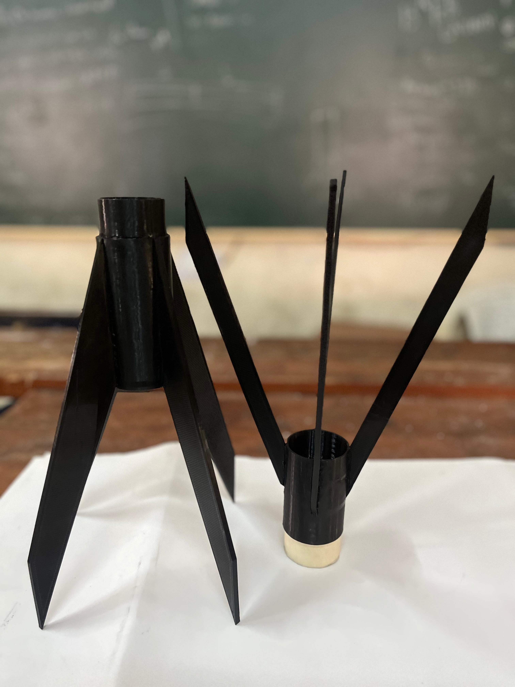<figcaption>
First and Second stage Fincans
</figcaption></figure> <figure>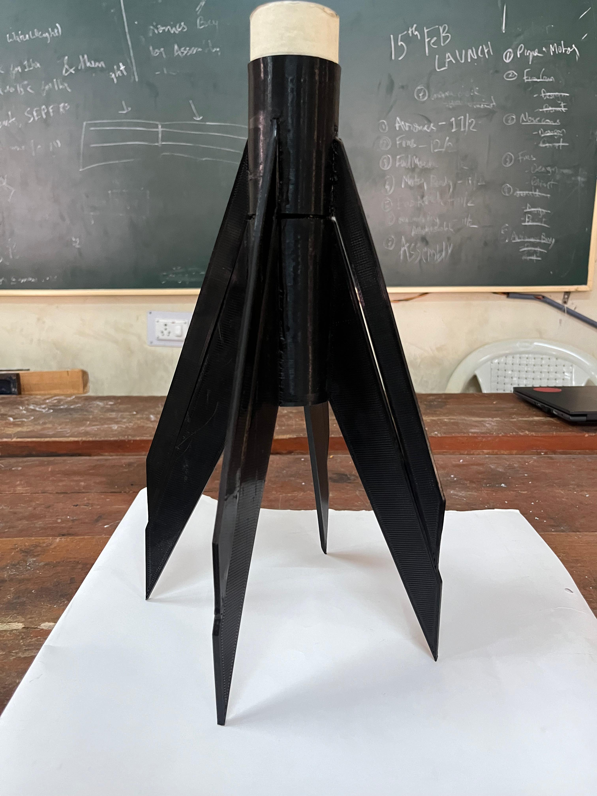<figcaption>
Assembled Fincans
</figcaption></figure>

#### First Stage

The first stage was as simple as it gets:

* One 3D printed fincan
* Fins
* A solid motor inside

We didn’t use any mechanical separation system. It was “loosely” attached, so after burnout, it would just fall away—or get hot staged after the second stage lit up. (Honestly, part of us kinda wanted to see that hot staging happen.)

<figure>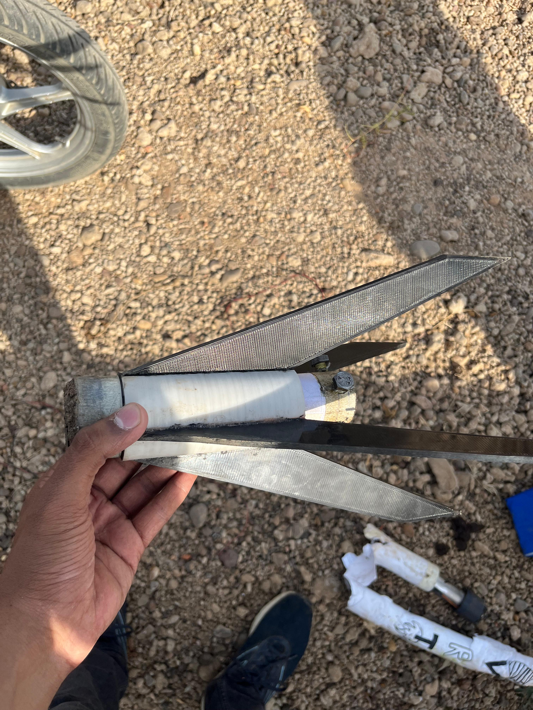<figcaption>
First stage Inspection After Lauch
</figcaption></figure> <figure><figcaption>
First stage meeting the ground after it's ballistic descent
</figcaption></figure>

#### Avionics Bay

This was where the brains of the rocket lived.\
We 3D printed a mounting plate with a slot for the power switch, and two discs with holes to mount it inside the body using screws. It held two flight computers, one on each side of the plate.

Right above it, we mounted a spring-loaded ejection system—secured with screws.\
(More on that later in the Recovery section.)

<figure><figcaption>
Avionics Bay (3D Printed)
</figcaption></figure> <figure>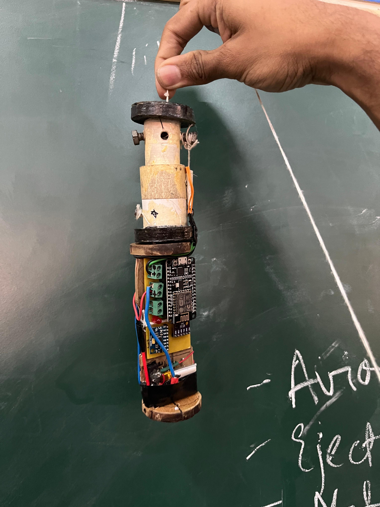<figcaption>
Ejection System mounted on Avionics Bay (wooden)
</figcaption></figure>

#### Engine Block

To keep the motor from sliding up the rocket, we added a wooden engine block—just a disc cut from plywood and epoxied into place. Simple, strong, and effective at transferring thrust directly to the airframe.

We used OpenRocket, an awesome open-source simulator, to model our full design. It let us estimate stability, CG/CP, and flight performance. OpenRocket is to structure what OpenMotor is to propulsion—super helpful and beginner-friendly.

### Avionics

This was the most important subsystem of the mission—our primary challenge was to design an avionics system capable of active stage separation.

In most traditional 2-stage model rockets, stage separation is passive. These rockets often use COTS (Commercial Off-The-Shelf) motors with well-known thrust curves. That makes it easy to design a system that simply triggers stage separation after a fixed time delay or at a certain altitude, based on predictable motor behavior.

But our case was different—we were flying in-house manufactured motors, so we didn’t have the luxury of precise thrust profiles. That meant we had to trigger the separation actively and intelligently, based on real-time sensor data.

#### Burnout Detection Logic

We decided to rely on acceleration values to detect motor burnout. During thrust, acceleration is significantly positive. The moment the motor burns out, acceleration drops— going negative due to drag and loss of thrust. We used this sudden drop as the primary indicator for burnout.

To make it more robust, we also checked how long the negative acceleration persisted—adding a layer of redundant logic to avoid false triggers.

#### Hardware Overview

Redundancy in avionics is critical—and dissimilar redundancy (using different hardware architectures) is even better. While we did that well in some areas, we also had room for improvement.

We flew two independent flight computers:

* Grace – Based on an Arduino Nano
* RocketNerve – Based on a NodeMCU with 4MB of internal flash (used for logging)

<figure><figcaption>
Grace
</figcaption></figure> <figure>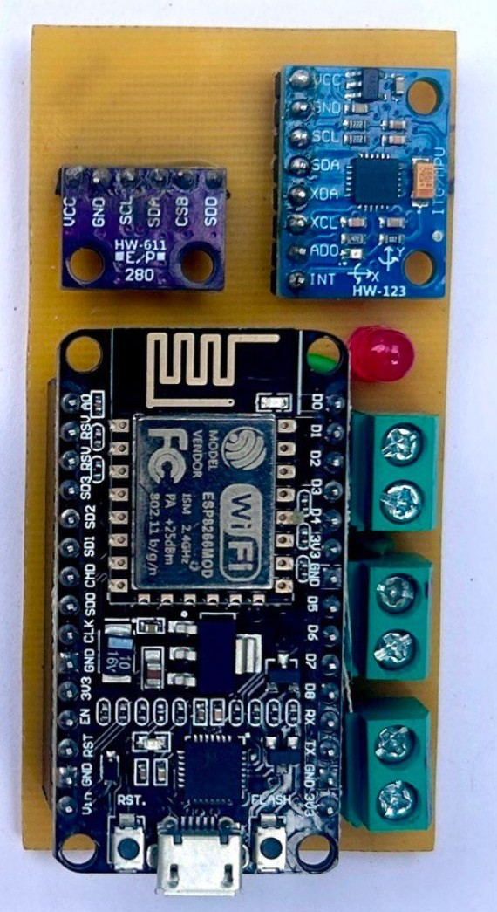<figcaption>
Rocket Nerve
</figcaption></figure>

Both systems followed the same basic architecture:

* 1 main microcontroller to process sensor data and trigger events
* BMP280 for barometric pressure and altitude
* MPU6050 for 6-axis inertial sensing (acceleration + angular velocity)
* Two pyro/ejection channels controlled via transistors acting as switches
* Powered by a 1S LiPo battery

This modular setup allowed us to process real-time flight data and trigger both stage separation and parachute ejection reliably.

#### Firmware & Control Logic

Both flight computers ran custom firmware, designed to:

1. Continuously monitor acceleration and altitude
2. Detect burnout based on the acceleration drop
3. Trigger stage separation
4. Monitor altitude for apogee detection
5. Trigger parachute ejection

We'll cover the detailed firmware and flowcharts for this logic in an upcoming blog post, but the key point is: everything was real-time and event-driven, not time-based.

### Recovery

For this flight, we decided to recover only the second stage. Technically, we did recover the first stage as well—but not through any dedicated system. It simply fell ballistically. Since the rocket wasn’t going to reach extreme altitudes, we figured that was acceptable.

#### Second Stage Recovery

The upper stage (second stage) had a spring-loaded parachute ejection system paired with a spherical ripstop nylon parachute. The parachute was connected to both the ejection mechanism and the nosecone, allowing for a safe recovery of both components after apogee.

<figure>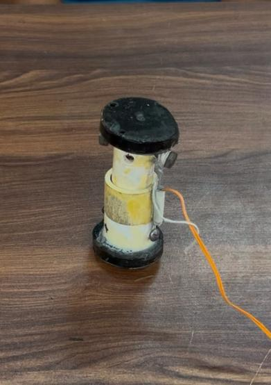<figcaption>
Loaded Ejection System
</figcaption></figure> <figure><figcaption>
Disassembled after lauch
</figcaption></figure>

#### How the Ejection System Worked

* A spring was mounted on top of the avionics bay, with help of a simple bottom mount structure, made with wood and PVC.&#x20;
* The spring was compressed and held in place by a thread tied between two screws—one at the bottom and one at the top of the ejection assembly.
* A disc-like platform sat on top of the spring, serving as a base for the neatly folded parachute.
* The thread holding the spring was rigged with an e-match (electronic match), surrounded by a small amount of gunpowder and secured with paper tape.
* This e-match was wired to both flight computers, giving either of them the ability to trigger deployment.

#### Deployment Logic

Once apogee was detected, either of the flight computers could trigger the e-match. When fired:

1. The e-match burns the thread.
2. The spring is released, pushing the parachute and nosecone outward.
3. The parachute unfurls mid-air, safely recovering the second stage.

It was a simple, robust, and lightweight recovery system that worked just as planned—no pistons, no CO₂ canisters, just good old mechanical ingenuity and a bit of gunpowder magic.

<figure>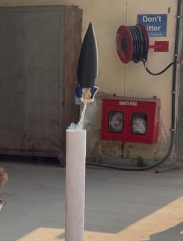<figcaption>
Tesing the ejection system
</figcaption></figure> <figure><figcaption>
Damaged Ejection system after launch
</figcaption></figure>

