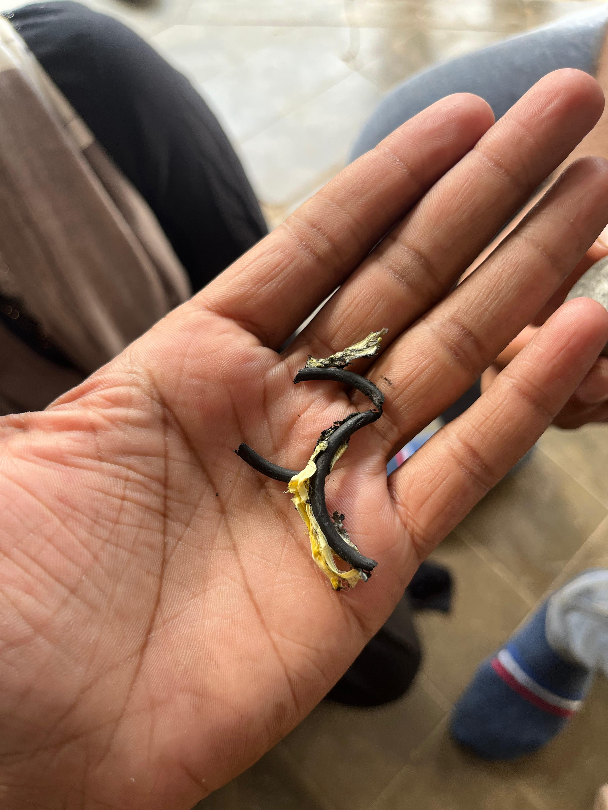
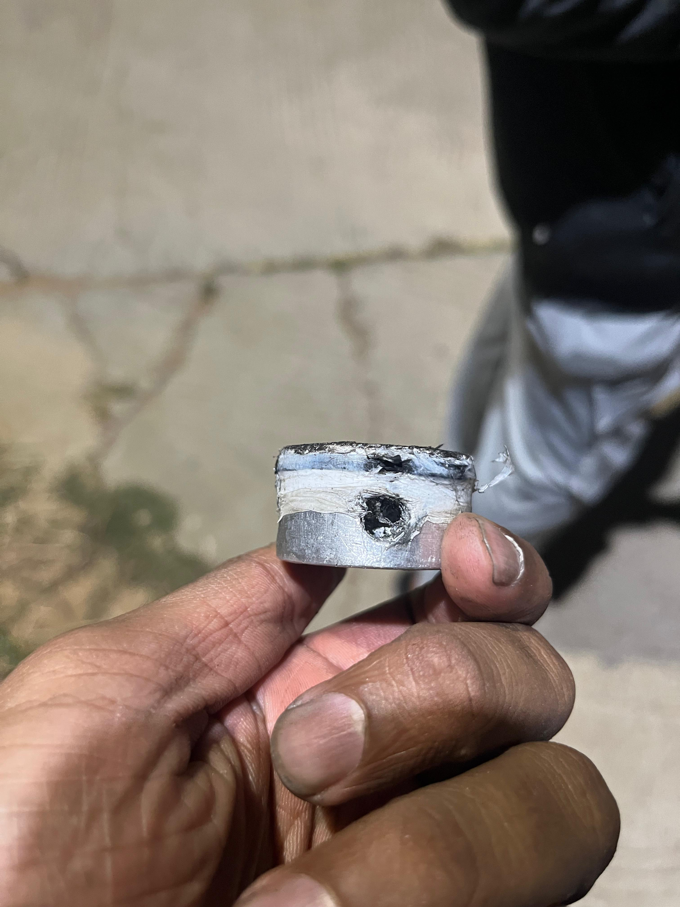
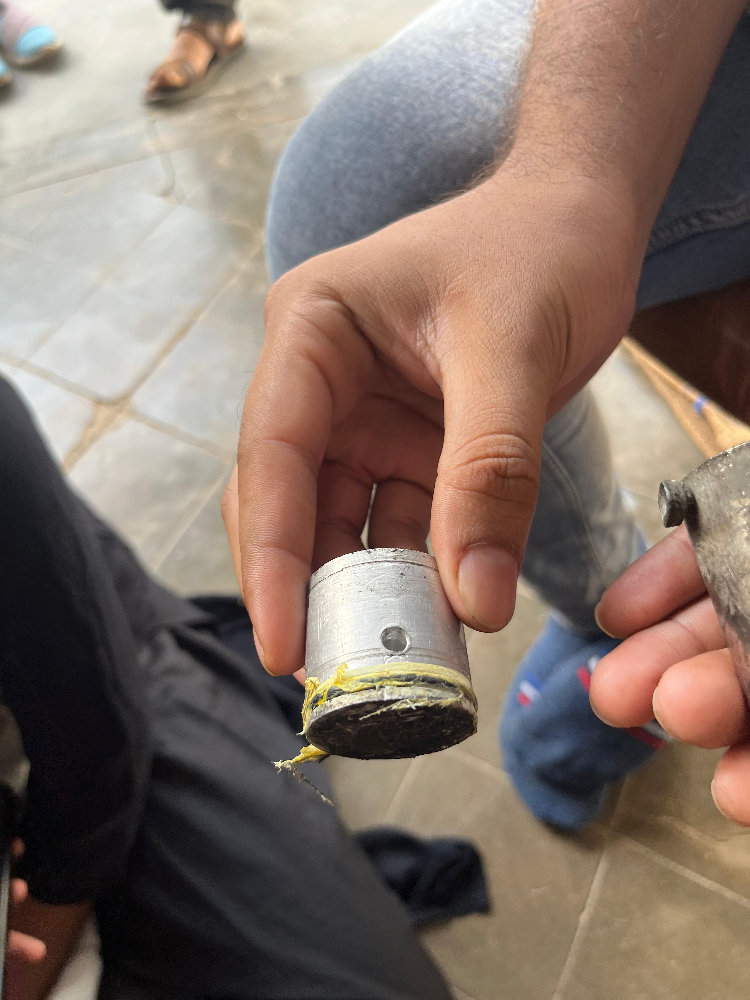
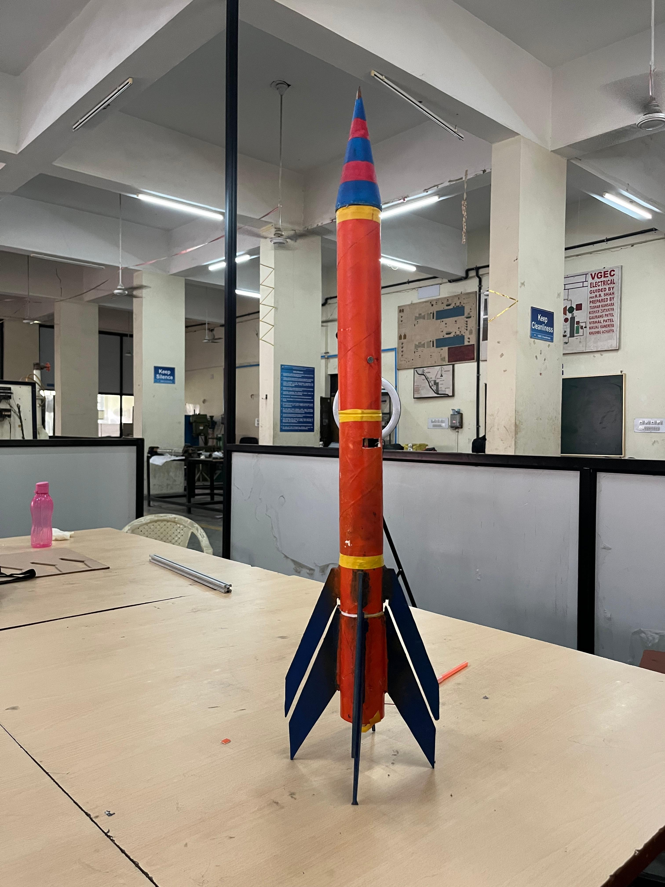
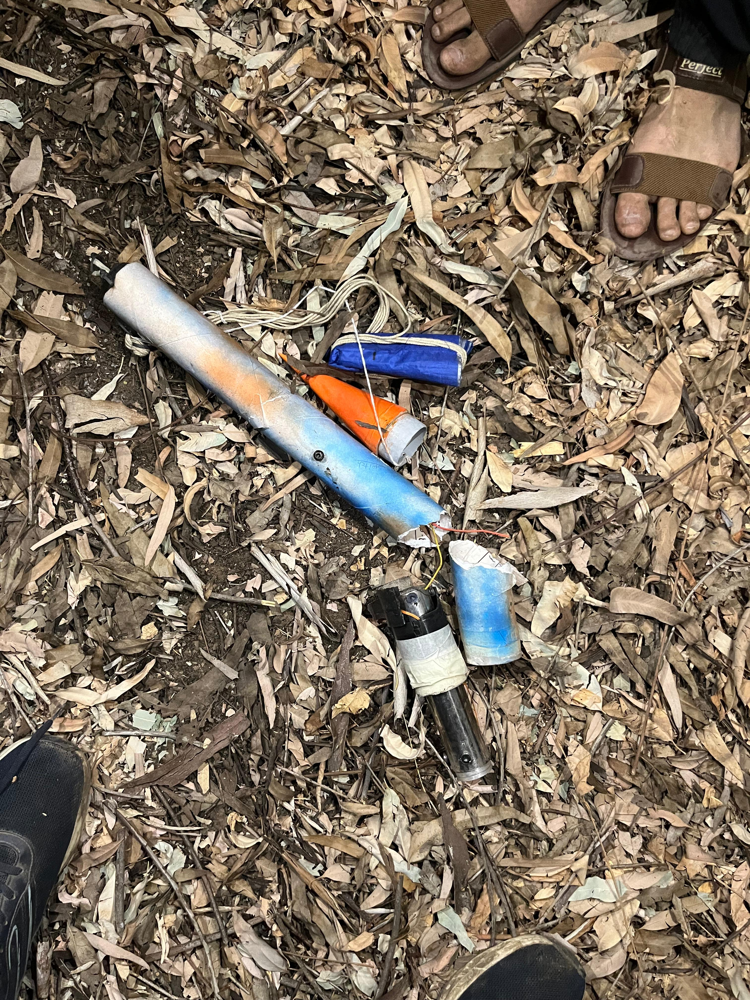
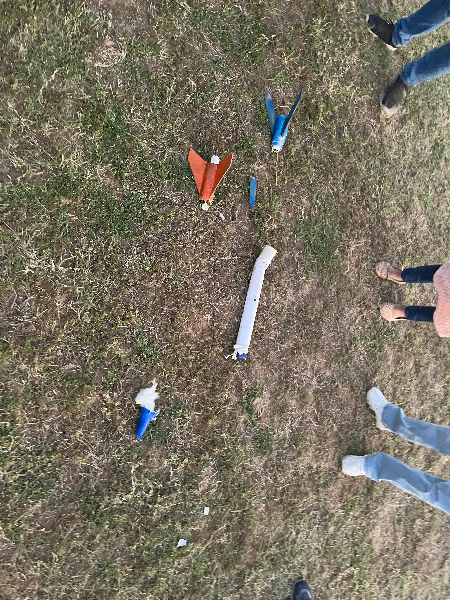
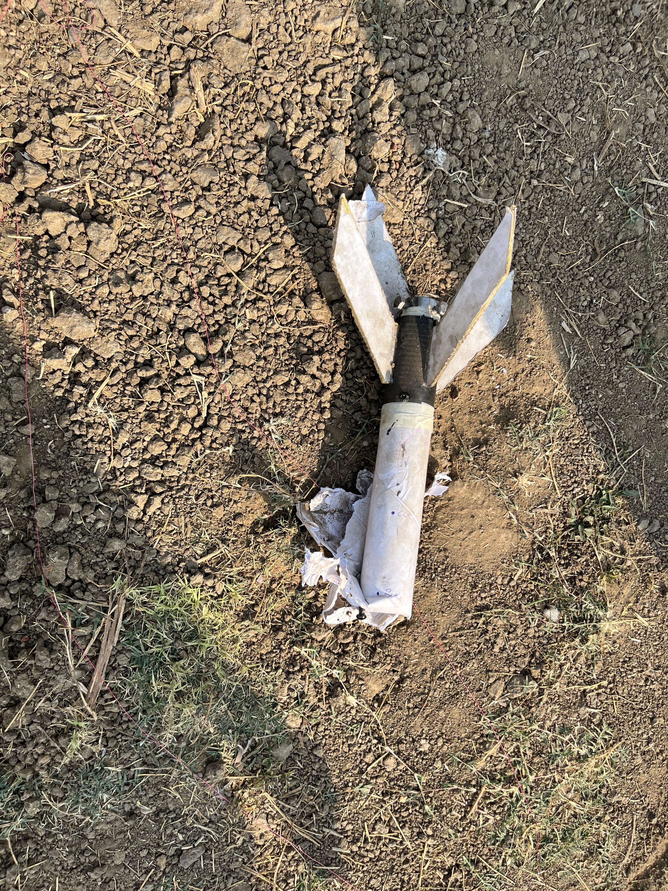

# Subsystem Survival Guide

By this point, you've seen our rocket go up, sideways, and sometimes just… not at all. But every charred fin and nose-dented tube taught us something. This section breaks down those hard-earned lessons subsystem by subsystem — from structure to avionics — so you can (hopefully) skip the part where your rocket looks like a flaming lawn dart. That’s the best thing about the internet. We made the mistakes so you don’t have to.

#### Metal Tubes and Mad Decisions: Designing Our Motor

(aka: That Time We Thought Shrinking a Motor Was a Good Idea)

Designing the metal motor was, hands down, one of the trickiest (and sweatiest) parts of the build. But instead of starting from scratch, we pulled a classic shortcut engineering move. We had already designed a longer motor for our big boy rocket, Aflatoon, and thought, “Why not just chop it down and call it a day?” Same nozzle, same end cap, same vibes. Saved us time, tools, and money — three things we were painfully short on.

Now, was that the right decision? Nope.

Even though we ran sims and tweaked grain geometry, the fundamental proportions of the nozzle and motor casing just didn’t vibe with the new length. We reused the motor design thinking we were being smart. The motor underperformed. Turns out, rockets don’t care about your budget hacks — only your math. If we could go back, we’d just design a proper motor from scratch. The performance hit we took because of those mismatched ratios wasn’t worth it.

Now let’s talk O-rings — the tiny rubber rings that somehow caused us more headaches than any explosive compound ever did.

The groove design in one of our end caps was a hot mess. We’d get the O-ring on, and then try to fit the end cap in — only for the ring to either tear, slip off, or just straight-up ghost us. Eventually, we reached peak jugaad mode — filing down the casing, stuffing in tire tubes (yes, tire tubes), wrapping things in Teflon tape, and praying to the Rocket Gods. It worked (somehow), but it was not fun. Pro tip: just take your time and design the O-ring system properly. Trust us — you don’t want to gamble with hot gases and bad seals.

Speaking of things that shouldn't be rushed...

The KNDX propellant-making process is long, tedious, and absolutely must be done in one go. Unfortunately, our schedules were allergic to 3–4 hour blocks of free time. So we kept splitting the process across days — big mistake. Turns out propellant doesn’t like being ghosted midway. That messed with the burn quality, and by extension, our entire launch.

Eventually, we got smarter. We started doing full batches in one go and storing the grains in airtight containers with calcium chloride to absorb moisture. Bonus tip: you can reuse the calcium chloride by baking it dry again — cheap, effective, and oddly satisfying.

Moral of the story? Shortcuts aren't always short, O-rings deserve more respect, and you really can’t treat propellant like a group project due next week.

<figure><figcaption></figcaption></figure> <figure><figcaption></figcaption></figure> <figure><figcaption></figcaption></figure> <figure><figcaption></figcaption></figure>

#### Wobbly by Design: Structural Regrets & Lessons

Precision in manufacturing is like the secret sauce of a stable rocket — the more accurate your build, the less your rocket flails around like a confused frisbee mid-air.

For smaller rockets, we learned that cardboard body tubes are the way to go. They’re fast, cheap, light, and surprisingly strong. If you’re working with limited resources (read: broke), cardboard is your best friend.

Now, if you have access to a 3D printer, use it. Hug it. Worship it. It’ll save you from a lot of headaches (and crooked fins). Unfortunately, at the time, we didn’t have one — long story involving budget, bad luck, and a cursed workshop. So we used wood and hard cardboard paper, which can work, but let’s just say you’ll start to question your life choices halfway through shaping a fincan with sandpaper.

We eventually got our hands on 3D printed parts, and the difference was night and day. Suddenly, everything fit. The fins were straight. The rocket stopped looking like it was built during an earthquake.

The big takeaway? When you compromise on structural precision, you compromise your rocket’s stability. A little wobble on the workbench becomes a whole lot of chaos in the sky. So if you can, go the extra mile in making your structure precise — your rocket (and your ego) will thank you.

<figure><figcaption>
Older Version 
</figcaption></figure> <figure><figcaption>
Latest Version
</figcaption></figure>

#### Making Smart Decisions with Dumb Hardware

By now, you’ve probably got a decent idea of our avionics architecture — a humble but functional setup that punched well above its weight… most of the time.

Our stage separation logic was built around a simple but effective idea: use an IMU (Inertial Measurement Unit) to monitor acceleration. When the first stage motor burned out, the rocket would experience a sharp drop in acceleration — boom, we’ve got our trigger. To avoid false positives (like wind gusts or sensor hiccups), we added a check to ensure that the drop persisted for a short duration before actually igniting the second stage.

But rockets don’t just go up — they can tip, twist, and tumble. So, we added a safety condition: only trigger the second stage if the rocket was still pointing upwards-ish, within a 30-degree cone from vertical. This angle, however, was calculated from — you guessed it — the same acceleration data that dropped during burnout. Yeah… see the problem?

We didn’t realize it at first, but when acceleration dropped (as it should), the derived angle values also went wild. Classic hardware limitation.

So, we pulled a late-night firmware patch: thanks to our Kalman filter, which was fusing noisy acceleration data with drifting gyro data, we had a delayed but smoother angle output. We widened our cone from 30° to 50° and leveraged that little lag in data processing as a buffer. It worked. Barely.

But let this be a loud and clear lesson:\
Always design your avionics with all necessary sensors from the start.\
If you're building a two-stage rocket and relying on orientation for safe staging, get a magnetometer. It’ll give you an absolute frame of reference using the Earth’s magnetic field — no weird math hacks, no accidental sideways ignitions.

Our hacky fix worked for our small flight profile, but if we were building something bigger? Let’s just say: it’s not a hill you want your rocket to die on.

#### Recovery? What Recovery?

We’d love to tell you we learned a lot about recovery systems — but honestly, we didn’t get enough successful flights to actually test them properly. So, this section is less of a guide and more of a list of regrets (but useful ones, promise).

Still, here are some crucial lessons:

* Attach your parachute to something that won’t rip off\
  Seems obvious, right? Well, not until you're watching your rocket nosedive because the part you tied your parachute to said, “No thanks” and yeeted itself off under shock load. Make sure you’re tying the recovery system to something structurally solid. Preferably not something decorative.
*   Don’t cheap out on parachute material

    Garbage bags work… until they don’t. A proper ripstop nylon chute or mylar sheet makes a big difference in reliability. Bonus: they fold better and survive repeated use.
* Make. An. Assembly. Checklist.\
  This one’s not just for recovery — it’s for your sanity. We once forgot to add padding in the nosecone, and that one silly oversight cost us a perfectly good descent. A simple checklist could’ve saved the day. It's boring. It's basic. But it works.

So yeah, can’t call ourselves “recovery experts” yet — but we are pretty good at spotting what not to do. You're welcome.

<figure><figcaption></figcaption></figure> <figure><figcaption></figcaption></figure> <figure><figcaption></figcaption></figure>

### Still Crashing, But Better

If you’ve made it this far — wow. Thanks. Hopefully you’ve learned a thing or two from our chaos. We definitely did.

This rocket was never meant to be perfect. It wasn’t about being the fastest, the highest, or the cleanest flight. It was about building something with whatever we had — tools that barely worked, timelines that didn’t exist, and way too much paper tape. But hey, it flew. Not flawlessly, but it flew.

Every stage, every subsystem, every random part of this project taught us something. Most of it the hard way. But that’s kind of the fun — making mistakes, figuring stuff out, and slowly becoming less terrible at this whole rocketry thing.

Right now? We’re already working on the next one. Bigger, better, hopefully with fewer near-heart-attacks. But the spirit stays the same — launch, learn, repeat.

So, if you're out there, trying to build something ambitious with scrap tools and wild ideas — you're not alone. Just keep building, keep testing, keep flying. And don't forget your checklist.

Catch you in the next launch.

If it didn’t explode, I probably helped build it. If it did… Well, lessons were learned.

&#x20;                                                                                                                                   _Written By_ [_Yash_](https://x.com/know_one08)
